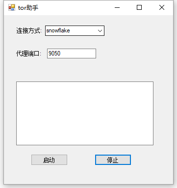

## 简易的 tor gui助手

实现基础的 tor 配置：连接方式、本地代理端口、启动、关闭。

目录说明

tor tor主程序

tor/PluggableTransports  snowflake-client插件

data tor数据目录

tor 下载链接：https://www.torproject.org/download/tor/

snowflake-client.exe 来自tor浏览器

tor/proxy.exe 来自 https://gitlab.torproject.org/tpo/anti-censorship/pluggable-transports/snowflake ，是 snowflake 中继。

chrome浏览器推荐使用[Proxy SwitchyOmega](https://chrome.google.com/webstore/detail/proxy-switchyomega/padekgcemlokbadohgkifijomclgjgif) 针对不同网站使用不用的代理策略。

## todo

更新tor

设置全局代理

设置pac代理